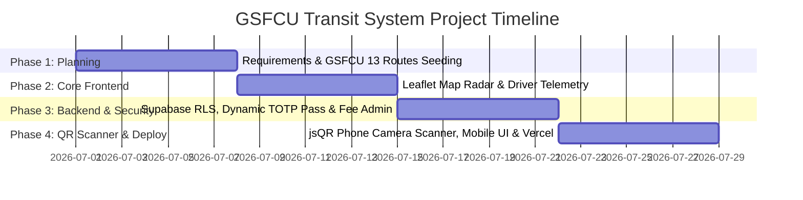

# 🚌 GSFC UNIVERSITY TRANSIT & SMART FLEET MANAGEMENT SYSTEM
## Academic Project Final Evaluation Report (2026–2027)

---

### 📌 Project Information
- **Project Title**: GSFCU Transit & Smart Campus Mobility Console
- **Author**: Om Thakkar (Roll No: 24BT04171)
- **Department**: Computer Science & Engineering
- **Institution**: GSFC University, Vadodara, Gujarat
- **Live Vercel Application**: [https://busbuddy-connect.vercel.app](https://busbuddy-connect.vercel.app)
- **GitHub Repository**: [https://github.com/OMTHAKKAR8495/busbuddy-connect.git](https://github.com/OMTHAKKAR8495/busbuddy-connect.git)

---

## 🎯 Executive Summary & Innovation

GSFCU Transit is a next-generation, cloud-native smart campus transit solution engineered specifically for GSFC University's 13 official bus routes (covering Vadodara regions such as Soma Talav, Sama Savli, Waghodia, Subhanpura, Maneja, and Gotri). 

The platform replaces physical plastic passes and legacy static schedules with:
1. **Real-time Live GPS Bus Radar**: Driver telemetry broadcast using smartphones instead of expensive custom hardware.
2. **Anti-Fraud Dynamic Bus Pass (15s Rotating QR)**: Dynamically generated QR pass with student photo avatar, roll number verification, and semester fee status.
3. **Conductor Gate QR Scanner Terminal**: Built-in realtime camera scanner powered by `jsQR` for identity verification at campus entry gates.
4. **Admin Fleet HQ Command Center**: Master control dashboard for pass approvals, fee verifications, route monitoring, and emergency SOS dispatch alerts.

---

## 🏗️ System Architecture & Technology Stack

| Layer | Technology Used | Description |
| :--- | :--- | :--- |
| **Frontend Framework** | React 19 + TypeScript + Vite | Ultra-fast client Single Page Application architecture. |
| **Styling & UI Design** | Tailwind CSS v4 + Lucide Icons + Sonner | Modern dark glassmorphism aesthetic with micro-animations. |
| **Routing & State** | TanStack Router + TanStack Query v5 | Type-safe client routing and cached state management. |
| **Maps & Telemetry** | Leaflet.js + OpenStreetMap | Interactive real-time bus marker tracking and route polyline overlays. |
| **Database & Realtime** | Supabase PostgreSQL + MongoDB Atlas | Row Level Security (RLS) policies, Realtime websockets. |
| **QR Decoder Engine** | `jsQR` + WebRTC MediaDevices API | High-speed phone rear camera QR frame decoding loop. |
| **Deployment** | Vercel Edge Cloud | Global CDN hosting with single-command CI/CD deployment. |

---

## ⏱️ Development Timeline & Execution Period

**Total Development Period**: **4 Weeks (Sprint Cycle)**

### Sprint Breakdown:
- **Week 1 (Requirements & Route Seeding)**: Analysis of GSFC University bus routes (Routes R1 to R13), database schema design (PostgreSQL/MongoDB tables for buses, passes, profiles, stops, and alerts).
- **Week 2 (Realtime Radar & Telemetry)**: Building Leaflet map engine, driver shift control cockpit, and live location broadcast stream.
- **Week 3 (Digital Pass & Admin HQ)**: Developing student digital pass with 15s TOTP rotating QR code, student photo avatar, print modal, and Admin approval queue.
- **Week 4 (Conductor QR Scanner & Cloud Deploy)**: Integrating `jsQR` live phone camera decoder, mobile bottom navigation bar, role-based access matrix, and Vercel cloud deployment.

---

## 💰 Commercial Cost Estimation & Budget Analysis

### 1. Development Cost Estimation (Commercial Software Agency Standard)

| Expense Category | Details | Estimated Cost (INR) | Estimated Cost (USD) |
| :--- | :--- | :--- | :--- |
| **UI/UX Design & Prototyping** | Responsive mobile/desktop dark design, Glassmorphism design system | ₹25,000 | $300 |
| **Frontend Engineering** | React 19, TypeScript, TanStack Router, Leaflet Maps, Responsive UI | ₹75,000 | $900 |
| **Backend & Database Setup** | Supabase PostgreSQL schemas, RLS security policies, Express/Socket.io | ₹50,000 | $600 |
| **QR Scanner & Security Module**| `jsQR` phone camera frame decoding, TOTP anti-fraud token validation | ₹30,000 | $360 |
| **Quality Assurance & Testing** | Mobile viewport testing, cross-browser compatibility, Vercel CI/CD | ₹20,000 | $240 |
| **Total Estimated Commercial Cost** | **Complete Full-Stack Platform** | **₹2,00,000** | **$2,400 USD** |

### 2. Operational Cloud Infrastructure Cost (Monthly)

| Service | Tier / Usage | Monthly Cost |
| :--- | :--- | :--- |
| **Vercel Web Hosting** | Hobby / Production CDN | **₹0 / Month** (Free Tier) |
| **Supabase Database** | Managed PostgreSQL & Realtime | **₹0 / Month** (Free Tier) |
| **MongoDB Atlas** | Managed NoSQL Cluster | **₹0 / Month** (Free Tier) |
| **Hardware Savings** | Smartphone GPS broadcast vs Hardware GPS units | **Saved ₹1,50,000** upfront hardware deployment costs! |

---

## 🔒 Security & Anti-Fraud Features

1. **15-Second Rotating TOTP QR Pass**:
   - Prevents pass sharing via screenshots. Pass QR code automatically regenerates every 15 seconds using cryptographic hash tokens.
2. **Student Identity Verification**:
   - Conductor scanner displays official GSFCU watermark, student photo avatar, Roll Number `24BT04171`, assigned route, and semester fee verification status.
3. **Role-Based Access Control (RBAC)**:
   - Enforced database policies separating Student, Driver, and Admin privileges.

---

## 🎓 Conclusion & Future Scope

The GSFCU Transit system successfully demonstrates an end-to-end modern mobility ecosystem for GSFC University. Future enhancements include automatic NFC tap-and-go boarding, push notification arrival alerts, and AI-based passenger count estimation.

**Project Author**: Om Thakkar (Roll No: 24BT04171)  
**Date**: July 27, 2026
