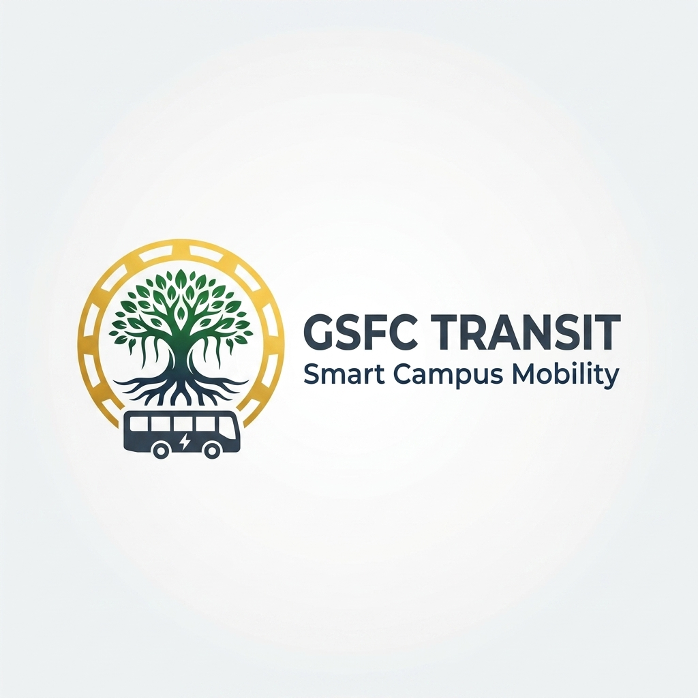

<div align="center">
  
  <h1>🚌 GSFCU Transit — Smart Campus Mobility & Fleet Platform</h1>
  
  [](https://busbuddy-connect.vercel.app)
</div>

GSFCU Transit is a custom-engineered, real-time campus shuttle tracking and digital transit management system built specifically for GSFC University students, shuttle drivers, and fleet transport administrators.

---

## 🌟 Key Features

- 📍 **Real-Time GPS Fleet Radar**: Live tracking map powered by Leaflet & OpenStreetMap, displaying active shuttle buses across Vadodara routes.
- 🎟️ **Anti-Fraud Dynamic Digital Pass**: Rotating visual token and secure QR pass for authenticated student pass verification.
- ⏱️ **Smart Stop ETAs**: Dynamic arrival predictions per route stop.
- 📢 **Emergency Driver Broadcast System**: Instant alerts pushed by bus drivers to active route passengers (delays, breakdowns, detour alerts).
- 🛡️ **Multi-Tier Role Management**: Secure access tiers tailored for Students, Drivers, and Transport Administrators.

---

## 🛠️ Built With

- **Framework**: [TanStack Start](https://tanstack.com/start) + React 19 + TypeScript
- **Styling**: Tailwind CSS v4 + Lucide Icons + Custom Glassmorphism UI
- **Database & Auth**: Supabase Realtime + Cloud Storage + Row Level Security
- **Mapping**: Leaflet + React Leaflet

---

## 🚀 Getting Started

### Prerequisites

- Node.js (v18+)
- Bun or npm

### Installation

```bash
# Clone repository
git clone https://github.com/OMTHAKKAR8495/busbuddy-connect.git
cd busbuddy-connect

# Install dependencies
bun install

# Start local development server
bun dev
```

---

## 🔒 Environment Variables

Copy `.env.example` to `.env` and fill in your Supabase credentials:

```env
VITE_SUPABASE_URL=your_supabase_project_url
VITE_SUPABASE_PUBLISHABLE_KEY=your_supabase_publishable_key
```

---

GSFCU Transit · Crafted with precision for campus transportation.
